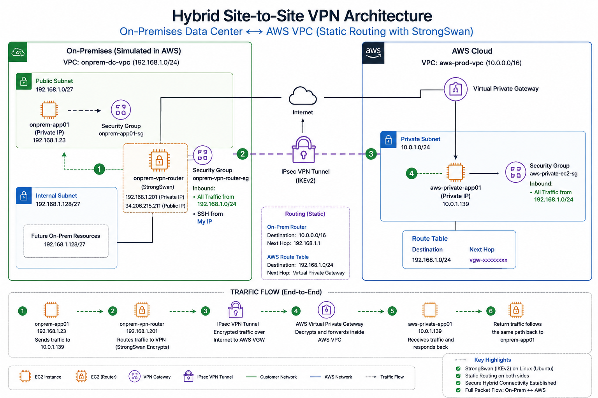

# Enterprise-Hybrid-Network-Simulation-using-AWS-Site-to-Site-VPN--Static-Route





## Project Overview

This project simulates a real-world enterprise hybrid cloud environment where an on-premises network securely communicates with a private AWS cloud network using an IPsec Site-to-Site VPN tunnel.

The lab was designed to replicate how enterprises connect their internal datacenter environments to AWS using:

* AWS Virtual Private Gateway (VGW)
* Customer Gateway (CGW)
* StrongSwan IPsec VPN Router
* Static Routing
* Private EC2 Communication
* Hybrid Routing Architecture

The project focused heavily on:

* Hybrid cloud networking
* VPN tunnel establishment
* Linux routing and packet forwarding
* AWS route tables
* Security groups
* IPsec troubleshooting
* Enterprise traffic flow analysis

---

# Project Goals

The main objective of this project was to build a secure hybrid cloud architecture where:

* An on-prem internal server communicates privately with an AWS private EC2 instance
* Traffic traverses an encrypted IPsec tunnel
* No public access exists to the AWS application EC2
* Static routing is used instead of BGP for simpler enterprise-style routing
* StrongSwan acts as a Linux-based Customer Gateway router

---

# Technologies & Services Used

## AWS Services

* Amazon VPC
* EC2
* Virtual Private Gateway (VGW)
* Customer Gateway (CGW)
* Site-to-Site VPN
* Route Tables
* Security Groups
* Internet Gateway

## Linux / Networking

* Ubuntu Server 24.04 LTS
* StrongSwan IPsec VPN
* Linux IP Forwarding
* SSH Jump Host Access
* Static Routing
* ICMP Testing
* IKEv2
* AES128 Encryption

---

# High-Level Architecture


                AWS CLOUD NETWORK
┌──────────────────────────────────────────────┐
│                                              │
│   aws-prod-vpc (10.0.0.0/16)                │
│                                              │
│   aws-private-subnet (10.0.1.0/24)          │
│          │                                   │
│          │                                   │
│   aws-private-app01                          │
│   Private EC2                                │
│   10.0.1.139                                 │
│          │                                   │
│          │                                   │
│   Virtual Private Gateway (VGW)              │
└──────────┼───────────────────────────────────┘
           │
           │  IPsec Site-to-Site VPN Tunnel
           │  IKEv2 + AES128 + SHA1
           │
┌──────────┼───────────────────────────────────┐
│          │                                   │
│   Customer Gateway (CGW)                     │
│                                              │
│   onprem-vpn-router                          │
│   StrongSwan VPN Router                      │
│   Public IP: 18.215.126.119                  │
│   Private IP: 192.168.1.201                  │
│                                              │
│   onprem-app01                               │
│   Internal Enterprise Host                   │
│   192.168.1.23                               │
│                                              │
│   onprem-dc-vpc                              │
│   192.168.0.0/16                             │
│                                              │
└──────────────────────────────────────────────┘
```

---

# Detailed Traffic Flow

## Hybrid Application Traffic Flow


onprem-app01 (192.168.1.23)
        ↓
On-Prem Route Table
        ↓
VPN Router ENI
        ↓
StrongSwan VPN Router
        ↓
IPsec Encryption
        ↓
AWS Site-to-Site VPN Tunnel
        ↓
Virtual Private Gateway (VGW)
        ↓
AWS Route Table
        ↓
aws-private-app01 (10.0.1.139)
```

---

# Step-by-Step Build Process

# Phase 1 — AWS Cloud Environment

## Step 1 — Created AWS Cloud VPC

Created a dedicated AWS cloud VPC:


aws-prod-vpc
10.0.0.0/16
```

Purpose:

* Represents enterprise cloud network
* Holds AWS private workloads
* Terminates VPN tunnel through VGW

Screenshot:

```text
01-aws-prod-vpc-created.png
```

---

## Step 2 — Created AWS Private Subnet

Created private subnet:

```text
aws-private-subnet
10.0.1.0/24
```

Disabled:

```text
Auto-assign public IPv4
```

Purpose:

* Ensures AWS EC2 remains private
* Forces communication through VPN only
* Simulates internal enterprise application subnet

Screenshots:

```text
02-aws-private-subnet-created.png
03-private-subnet-auto-public-ip-disabled.png
```

---

## Step 3 — Launched AWS Private EC2

Created:

```text
aws-private-app01
```

Configuration:

* Ubuntu Server 24.04 LTS
* No public IP
* Private subnet deployment

Security Group Rules:

| Type | Source         |
| ---- | -------------- |
| SSH  | 192.168.0.0/16 |
| ICMP | 192.168.0.0/16 |

Purpose:

* Simulates internal cloud workload
* Receives traffic only over VPN tunnel

Screenshots:

```text
04-aws-private-ec2-created.png
05-private-ec2-security-group.png
```

---

## Step 4 — Created Virtual Private Gateway (VGW)

Created:

```text
aws-vgw
```

Attached VGW to:

```text
aws-prod-vpc
```

Purpose:

* AWS-side VPN endpoint
* Terminates IPsec tunnel
* Handles encrypted hybrid traffic

Screenshots:

```text
06-virtual-private-gateway-created.png
07-vgw-attached-to-vpc.png
```

---

# Phase 2 — Simulated On-Prem Environment

## Step 5 — Created On-Prem VPC

Created:

```text
onprem-dc-vpc
192.168.0.0/16
```

Purpose:

* Simulates enterprise datacenter network
* Represents on-prem environment

Screenshot:

```text
08-onprem-vpc-created.png
```

---

## Step 6 — Created On-Prem Public Subnet

Created:

```text
onprem-public-subnet
192.168.1.0/24
```

Enabled:

```text
Auto-assign public IPv4
```

Purpose:

* Hosts VPN router EC2
* Provides internet access for IPsec tunnel establishment

Screenshots:

```text
09-onprem-public-subnet-created.png
10-onprem-public-subnet-auto-public-ip-enabled.png
```

---

## Step 7 — Created Internet Gateway

Created:

```text
onprem-igw
```

Attached to:

```text
onprem-dc-vpc
```

Purpose:

* Provides internet connectivity
* Required for IPsec negotiation with AWS

Screenshots:

```text
11-onprem-internet-gateway-created.png
12-onprem-igw-attached-to-vpc.png
```

---

## Step 8 — Configured Public Route Table

Created:

```text
onprem-public-rt
```

Added default route:

```text
0.0.0.0/0 → onprem-igw
```

Associated route table with:

```text
onprem-public-subnet
```

Purpose:

* Allows internet connectivity
* Enables VPN router communication with AWS VPN endpoints

Screenshots:

```text
13-onprem-public-route-table-created.png
14-onprem-default-route-to-igw.png
15-onprem-subnet-route-table-association.png
```

---

## Step 9 — Launched VPN Router EC2

Created:

```text
onprem-vpn-router
```

Configuration:

* Ubuntu Server 24.04 LTS
* Public IP enabled
* StrongSwan VPN software

Security Group Rules:

| Type     | Source       |
| -------- | ------------ |
| SSH      | My Public IP |
| UDP 500  | 0.0.0.0/0    |
| UDP 4500 | 0.0.0.0/0    |
| ICMP     | 10.0.0.0/16  |

Purpose:

* Simulates enterprise VPN appliance
* Acts as Customer Gateway device
* Terminates IPsec VPN tunnel

Screenshots:

```text
16-onprem-vpn-router-created.png
17-onprem-vpn-router-security-group.png
```

---

## Step 10 — Disabled Source/Destination Check

Disabled source/destination checking on:

```text
onprem-vpn-router
```

Purpose:

* Allows EC2 to forward traffic between networks
* Enables router functionality

Screenshot:

```text
18-source-destination-check-disabled.png
```

---

# Phase 3 — Linux VPN Router Configuration

## Step 11 — SSH Access to VPN Router

Connected to VPN router EC2 using SSH key-based authentication.

Screenshot:

```text
19-ssh-into-onprem-vpn-router.png
```

---

## Step 12 — Updated Linux Package Repositories

Executed:

```bash
sudo apt update
```

Purpose:

* Refreshes package repository metadata
* Ensures latest package availability

Screenshot:

```text
20-linux-package-repositories-updated.png
```

---

## Step 13 — Installed StrongSwan

Installed:

```bash
sudo apt install strongswan -y
```

Verified using:

```bash
ipsec version
```

Purpose:

* Provides IPsec VPN functionality
* Converts Linux server into enterprise VPN router

Screenshots:

```text
21-strongswan-installed.png
22-strongswan-version-verification.png
```

---

## Step 14 — Enabled Linux IP Forwarding

Executed:

```bash
sudo sysctl -w net.ipv4.ip_forward=1
```

Verified using:

```bash
sysctl net.ipv4.ip_forward
```

Purpose:

* Allows Linux kernel to forward packets between interfaces
* Enables router behavior

Screenshots:

```text
23-ip-forwarding-enabled.png
24-ip-forwarding-verification.png
```

---

## Step 15 — Made IP Forwarding Persistent

Modified:

```text
/etc/sysctl.conf
```

Enabled:

```text
net.ipv4.ip_forward=1
```

Applied changes:

```bash
sudo sysctl -p
```

Purpose:

* Maintains forwarding after reboot

Screenshots:

```text
25-permanent-ip-forwarding-configured.png
26-sysctl-permanent-settings-applied.png
```

---

# Phase 4 — VPN Tunnel Creation

## Step 16 — Created Customer Gateway (CGW)

Created:

```text
onprem-cgw
```

Configured using VPN router public IP:

```text
18.215.126.119
```

Purpose:

* Represents enterprise VPN appliance inside AWS

Screenshot:

```text
27-customer-gateway-created.png
```

---

## Step 17 — Created Site-to-Site VPN Connection

Created:

```text
hybrid-site-to-site-vpn
```

Configuration:

* Static routing
* IKEv2
* AES128 encryption
* SHA1 authentication

Configured Static Route:

```text
192.168.0.0/16
```

Purpose:

* Establishes encrypted hybrid tunnel between AWS and on-prem network

Screenshots:

```text
28-site-to-site-vpn-created.png
29-static-routing-configured.png
30-vpn-tunnel-initial-down-state.png
```

---

## Step 18 — Downloaded AWS VPN Configuration

Downloaded AWS-generated StrongSwan VPN configuration.

Purpose:

* Avoids manual tunnel parameter errors
* Uses AWS-generated tunnel settings and pre-shared keys

Screenshot:

```text
31-aws-vpn-configuration-download-settings.png
```

---

## Step 19 — Created StrongSwan Backups

Created backups:

```bash
/etc/ipsec.conf.bak
/etc/ipsec.secrets.bak
```

Purpose:

* Preserves original configuration files
* Enables rollback during troubleshooting

Screenshots:

```text
32-strongswan-config-backups-created.png
33-strongswan-backup-files-verified.png
```

---

## Step 20 — Configured StrongSwan Tunnel

Configured:

```text
/etc/ipsec.conf
```

Configured:

* Tunnel endpoints
* Encryption algorithms
* Traffic selectors
* IKEv2 settings
* Phase 1 and Phase 2 parameters

Screenshot:

```text
34-strongswan-ipsec-conf-configured.png
```

---

## Step 21 — Configured Pre-Shared Key

Configured:

```text
/etc/ipsec.secrets
```

Purpose:

* Authenticates AWS VGW and StrongSwan router
* Establishes trusted IPsec tunnel

Screenshot:

```text
35-strongswan-pre-shared-key-configured.png
```

---

## Step 22 — Restarted StrongSwan Service

Executed:

```bash
sudo systemctl restart strongswan-starter
```

Verified:

```bash
sudo systemctl status strongswan-starter
```

Purpose:

* Loads VPN configuration
* Initiates IPsec negotiation with AWS

Screenshots:

```text
36-strongswan-service-restarted.png
37-strongswan-service-running.png
```

---

## Step 23 — Verified Tunnel Establishment

Verified successful tunnel negotiation using:

```bash
sudo ipsec statusall
```

Observed:

```text
ESTABLISHED
CHILD_SA
INSTALLED
```

Purpose:

* Confirms successful IKE and IPsec negotiation
* Verifies traffic selectors and encryption policies

Screenshots:

```text
38-ipsec-tunnel-successfully-established.png
46-strongswan-ipsec-tunnel-established-status.png
45-aws-vpn-tunnel-up-status.png
```

---

# Phase 5 — Hybrid Routing Configuration

## Step 24 — Configured AWS Route Table

Added route:

```text
192.168.0.0/16 → aws-vgw
```

Purpose:

* Routes on-prem traffic into VPN tunnel

Screenshots:

```text
39-aws-route-to-vgw-configured.png
40-aws-private-route-table-updated.png
```

---

## Step 25 — Created Internal On-Prem Server

Created:

```text
onprem-app01
```

Configuration:

* No public IP
* Internal enterprise application server

Purpose:

* Simulates internal enterprise host
* Sends traffic through VPN router toward AWS

Screenshots:

```text
41-onprem-internal-app-server-created.png
42-onprem-app-server-security-group.png
```

---

## Step 26 — Configured On-Prem Route Table

Created:

```text
onprem-internal-rt
```

Configured route:

```text
10.0.0.0/16 → VPN Router ENI
```

Purpose:

* Sends AWS traffic toward VPN router
* Enables hybrid routing path

Screenshots:

```text
43-onprem-route-to-vpn-router-configured.png
44-onprem-route-table-associated.png
```

---

# Final Connectivity Validation

## Successful Hybrid Connectivity Test

SSH Jump Path:

```text
Laptop
→ VPN Router
→ onprem-app01
```

Hybrid Ping Test:

```bash
ping -c 4 10.0.1.139
```

Successful Result:

```text
64 bytes from 10.0.1.139
```

Purpose:

* Validates full end-to-end hybrid routing
* Confirms AWS private EC2 communication over IPsec tunnel

Screenshots:

```text
47-onprem-to-aws-private-ec2-ping-success.png
48-vpn-router-sg-allows-onprem-app-traffic.png
```

---

# Major Troubleshooting & Lessons Learned

# 1. VPN Tunnel Up But No Traffic Flow

## Problem

Tunnel successfully established:

```text
ESTABLISHED
CHILD_SA INSTALLED
```

But ICMP traffic failed between on-prem and AWS.

---

## Root Cause

The VPN router security group did NOT allow traffic originating from:

```text
192.168.1.23
```

Traffic was blocked before StrongSwan could encrypt and forward packets.

---

## Fix

Added inbound rule to:

```text
onprem-vpn-router-sg
```

Allowed:

```text
All Traffic → 192.168.1.0/24
```

Result:

```text
Hybrid connectivity immediately succeeded
```

---

# 2. SSH Jump Host Failure

## Problem

Unable to SSH from VPN router into:

```text
onprem-app01
```

---

## Root Cause

The internal EC2 security group only allowed SSH from:

```text
My Public IP
```

But actual SSH source became:

```text
192.168.1.201
```

(the VPN router private IP)

---

## Fix

Added inbound SSH rule allowing:

```text
192.168.1.201/32
```

to:

```text
onprem-app01-sg
```

Result:

```text
SSH jump host access succeeded
```

---

# 3. Route Table Misconfiguration

## Problem

VPN router temporarily lost internet access.

SSH sessions timed out.

---

## Root Cause

Subnet association was changed to a new route table that did NOT contain:

```text
0.0.0.0/0 → Internet Gateway
```

---

## Fix

Re-added:

```text
0.0.0.0/0 → onprem-igw
```

Result:

```text
Internet connectivity restored
SSH access restored
```

---

# 4. Linux Route Troubleshooting

## Problem

Traffic selectors and routes initially mismatched.

---

## Root Cause

StrongSwan configuration initially used:

```text
leftsubnet=192.168.0.0/16
```

instead of:

```text
192.168.1.0/24
```

---

## Fix

Updated StrongSwan tunnel selector:

```text
leftsubnet=192.168.1.0/24
```

Restarted StrongSwan service.

Result:

```text
Correct traffic selectors loaded
Tunnel stabilized correctly
```

---

# Key Technical Skills Demonstrated

* Hybrid Cloud Networking
* AWS Site-to-Site VPN
* StrongSwan VPN Deployment
* Virtual Private Gateway (VGW)
* Customer Gateway (CGW)
* Static Routing
* Linux IP Forwarding
* Route Table Design
* Security Group Design
* Linux Networking Troubleshooting
* SSH Jump Host Architecture
* Enterprise VPN Architecture
* IPsec Troubleshooting
* Traffic Flow Analysis

---

# Resume Project Description

## Enterprise Hybrid Network Simulation using AWS Site-to-Site VPN

Built a real-world hybrid cloud networking environment connecting a simulated on-premises datacenter to AWS using an encrypted IPsec Site-to-Site VPN tunnel. Configured AWS Virtual Private Gateway (VGW), Customer Gateway (CGW), StrongSwan-based Linux VPN router, static routing, Linux IP forwarding, AWS route tables, and private EC2 communication. Successfully established end-to-end hybrid connectivity between internal on-prem and AWS private workloads while troubleshooting routing, traffic forwarding, and security group issues.

---

# Final Project Outcome

Successfully built a fully functional enterprise-style hybrid cloud architecture featuring:

```text
✔ AWS Site-to-Site VPN
✔ StrongSwan Customer Gateway
✔ Virtual Private Gateway (VGW)
✔ Static Routing
✔ Linux IP Forwarding
✔ Private EC2 Communication
✔ End-to-End Hybrid Connectivity
✔ Enterprise Troubleshooting Workflow
✔ Real IPsec Tunnel Encryption
```

---


```

